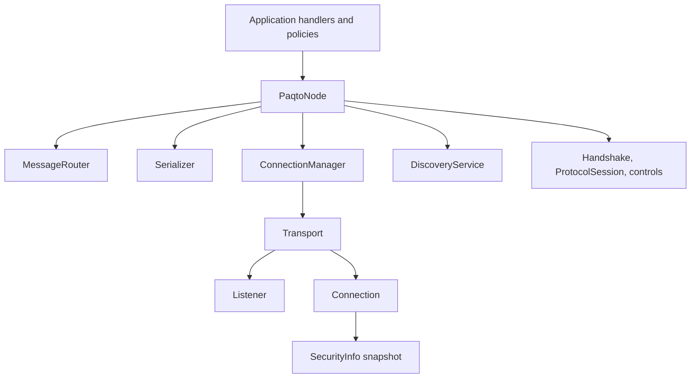
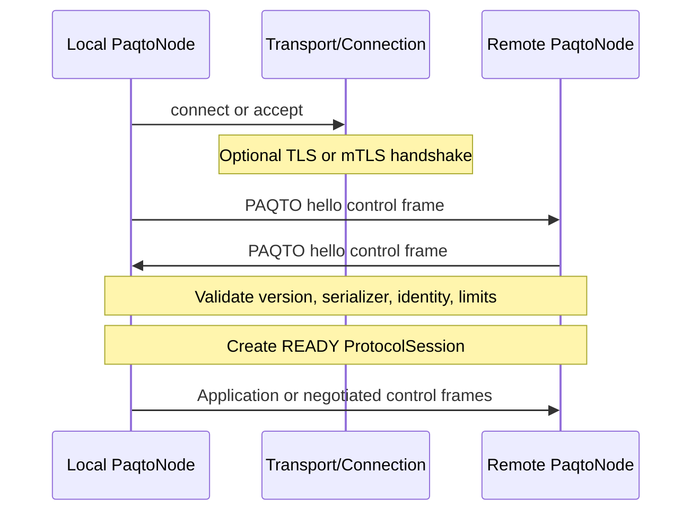

# Architecture and node lifecycle

Paqto keeps media access, reachability, message encoding, protocol rules, and
application behavior in separate layers. Core code depends on abstract
contracts; concrete transports and discovery services implement those
contracts at the edge.

This direction prevents TCP, UDP, TLS, or application terminology from leaking
into the generic message and routing APIs. A different medium can implement
`Transport`, `Connection`, and `Listener`; a different discovery mechanism can
implement `DiscoveryService`; applications choose their own serializer and
message semantics.

## Core roles

- `PaqtoNode` is the public async facade. It owns one local `Peer`, adapter
  lifecycle, READY sessions, connection selection, readers/writers, routing,
  correlation, heartbeat, reconnect, queues, events, and coordinated cleanup.
- `Peer` is a logical identity: an `id`, optional display name, and generic
  metadata. The node creates a random hexadecimal id unless `peer_id` is given.
- `Endpoint` is a transport-specific address plus metadata. It says how to
  reach something; it does not prove identity.
- `DiscoveredPeer` combines a `Peer` claim, endpoints, discovery metadata, and
  `last_seen`. It is a timestamped reachability observation.
- `DiscoveryService` announces a local peer and returns `DiscoveredPeer`
  objects. Discovery is independent from opening a connection.
- `Transport` owns medium-specific resources and creates outgoing `Connection`
  objects and an incoming `Listener`.
- `Connection` is an async complete-frame channel. It exposes local/remote
  endpoints, closed state, an immutable `SecurityInfo`, send/receive, and close.
- `Listener` starts an incoming endpoint and yields accepted `Connection`
  objects.
- `Serializer` converts the complete application `Message` envelope to and from
  bytes. It does not encode Paqto control frames.
- `Message` is the generic application envelope.
- `MessageRouter` invokes registered handlers for a message type and normalizes
  handler failures.
- `ConnectionManager` coalesces concurrent outgoing connects per peer, tracks
  logical connection states, and owns the canonical manager connection.
- Protocol components create `HandshakeOffer` and immutable
  `ProtocolSession` values, distinguish control from application frames, and
  implement hello, ACK, PING, and PONG controls.
- Security components expose transport-neutral `SecurityInfo`; the LAN adapter
  adds high-level `TlsConfig`, injected `TlsContextConfig`, and generic
  certificate-to-peer identity resolution.
- `PaqtoConfig`, `ReconnectPolicy`, `BackpressurePolicy`, and
  `HandlerErrorPolicy` define runtime behavior without changing adapter APIs.
- `NodeEvent` and `NodeEventType` expose best-effort lifecycle and failure
  observations.

## Session establishment

An open socket is not an application session.

For outgoing connections, `ConnectionManager` caches the candidate only after
protocol preparation succeeds. Incoming accepted connections negotiate in
node-owned tasks so the accept loop can continue. A failed or cancelled
handshake closes the connection and never creates READY state.

## Startup

`PaqtoNode.start()` serializes lifecycle changes and performs these steps:

1. start the transport;
2. create and start a listener;
3. start discovery with the local peer and advertised listener endpoint;
4. store the listener and mark the node running;
5. create fresh bounded inbound/event queues;
6. start the fixed handler-worker pool, event worker, and accept loop.

Partial startup failure performs best-effort rollback of discovery, listener,
and transport resources. A concurrent second start raises
`AlreadyStartedError` after the first completes. A stopped node may be started
again when its adapters support restart; the built-in LAN adapters do. A full
`stop()` invalidates cached reachability so a later start cannot silently reuse
an endpoint snapshot from the previous network lifecycle.

## Discovery and connect

`discover()` removes expired known observations, delegates to the configured
service, applies the node-level TTL, remembers fresh peers, and emits discovery
events. `connect()` accepts a `DiscoveredPeer` directly or a known `Peer`.
Passing an unknown `Peer` raises `PeerNotFoundError`.

The selected endpoint must match `transport.name`. The manager uses one shared
connect attempt per peer while allowing unrelated peers to connect in parallel.
Transport security, the Paqto hello, identity checks, capability negotiation,
and duplicate-session selection all complete before `connect()` returns.

## READY messaging

Each READY physical connection owns:

- one reader task;
- one bounded outbound frame queue and writer task;
- optional heartbeat state;
- one immutable `ProtocolSession`;
- exact-connection request and ACK correlations.

The reader handles control frames, deserializes and validates application
envelopes, checks sender/recipient consistency, resolves replies, and submits
ordinary messages to the node-wide bounded dispatch queue. Fixed workers call
the router. Protocol controls never enter the serializer or handlers.

## Disconnect, reconnect, and shutdown

Unexpected loss removes the exact session, fails its pending requests and ACKs,
stops heartbeat/writer resources, emits `DISCONNECTED`, and may schedule
reconnect. Reconnect creates a new physical connection and repeats transport
security plus protocol negotiation. It does not revive old correlations or
reuse old trust state.

`disconnect(peer)` is intentional: it closes the peer session and suppresses
automatic reconnect until a later explicit `connect()`.

`network_changed()` is the generic host-notification boundary for interface,
route, or address changes. It performs a complete network stop/start, obtains a
new listener endpoint, republishes it through discovery, invalidates old remote
endpoint snapshots, and performs one discovery pass. Peers that were connected
or reconnecting before the refresh are scheduled again when reconnect policy is
enabled. This repeats TCP/TLS and the Paqto handshake; no old socket, trust
result, or READY state is reused. With reconnect disabled, the host can use the
returned observations for explicit `connect()` calls.

`stop()` is idempotent. It marks the node not running, fails pending operations,
cancels and gathers accept/read/dispatch/event/write/heartbeat/reconnect tasks,
closes physical connections and manager/listener/discovery/transport resources,
and discards volatile queues. Cleanup stages are attempted even when one fails;
the first non-cancellation cleanup error is raised after the attempts. If the
task awaiting `stop()` is cancelled, Paqto completes the atomic cleanup before
re-raising cancellation. Third-party adapters must cooperate: an adapter
whose `close()` or `stop()` never returns can still prevent shutdown from
finishing.

Paqto does not install signal handlers, own the process, create a global event
loop, or change event-loop policy. Core APIs are awaitable inside the loop
managed by the host. The host decides when its own foreground/background or
suspend/resume transitions should call `stop()`, `start()`, or
`network_changed()`.

See [Reliability](reliability.md) for state transitions and concurrency details,
and [Protocol](protocol.md) for wire/session semantics.
