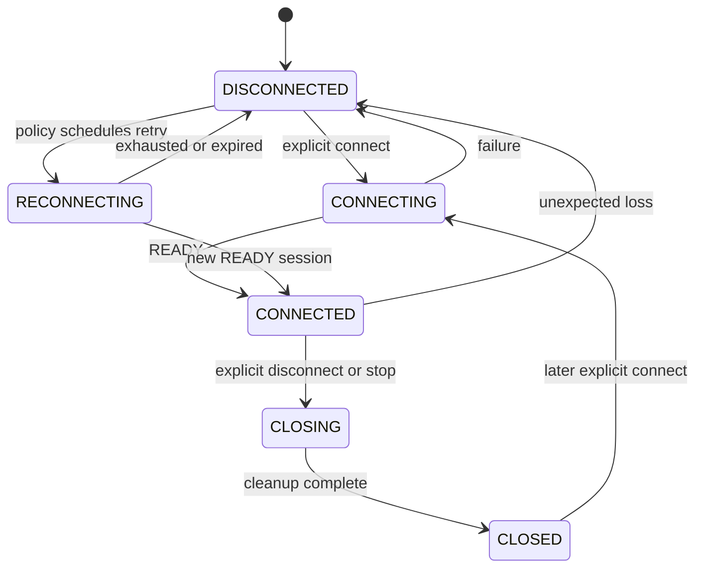

# Reliability, reconnect, concurrency, and backpressure

Paqto supervises volatile sessions and bounds many counts, but it is not a
durable messaging system. Reliability features restore and observe a connection;
they do not retry application messages or preserve in-flight state across a new
session.

## Logical connection states

`ConnectionState` describes orchestration for one peer, not a physical socket:



Inspect state with `node.connection_state(peer)` and the canonical READY
connection with `node.connection_for_peer(peer)`. A closed physical connection
is removed from the manager and does not remain `CONNECTED`.

## Concurrent connect and duplicate sessions

`ConnectionManager` performs one shared outgoing connection attempt per peer.
Concurrent callers await it through `asyncio.shield`, so cancellation of one
waiter does not cancel the shared attempt. Different peers may connect in
parallel.

At most one READY application session is canonical for a logical peer. If both
nodes connect simultaneously, the peer with the lexicographically smaller
`Peer.id` keeps its outbound channel; the other keeps the corresponding inbound
end. Same-direction duplicates keep the first session to reach READY. Losing
connections are deactivated, exact-connection pending state is failed, and the
connections are closed.

`max_connections` counts physical connections admitted by the node, including
incoming handshakes. A value too low may prevent the transient second channel
needed for simultaneous-open resolution.

## Automatic reconnect

Reconnect is disabled by default:

```python
from paqto import PaqtoConfig, ReconnectPolicy

config = PaqtoConfig(
    reconnect=ReconnectPolicy(
        enabled=True,
        initial_delay=0.5,
        multiplier=2,
        maximum_delay=30,
        jitter=0.1,
        max_attempts=None,
    )
)
```

Before zero-based attempt `n`, Paqto waits:

```text
min(maximum_delay, initial_delay * multiplier ** n)
```

Jitter multiplies that bounded delay by a random factor in
`[1 - jitter, 1 + jitter]`. `max_attempts=None` permits retries while the node
runs; an integer sets a finite positive limit.

Only unexpected loss of the canonical session schedules reconnect. An explicit
`disconnect()` suppresses it until explicit `connect()`. Each attempt uses the
latest remembered discovery object if it is still fresh. A peer known only
from an inbound session cannot be dialed without a discovered endpoint.

Every reconnect creates a new `Connection`, repeats TLS/mTLS if configured,
performs a new hello, rechecks expected and authenticated identities,
renegotiates capabilities and limits, and creates a new `ProtocolSession`. No
trust or READY status from the old socket is reused.

Pending requests, ACK waits, and frames attached to the lost session fail
before reconnect. Paqto does not resend them. A reply on a later connection
cannot complete an old request. `last_reconnect_error(peer)` retains the most
recent attempt failure for diagnostics.

## Heartbeat and idle timeout

Set `heartbeat_interval` to initiate negotiated PING/PONG checks. PING is sent
only after no inbound frame has arrived for one interval. The pending PONG is
registered before the PING is queued. A matching PONG must arrive on the exact
connection within `heartbeat_timeout`; otherwise the connection closes and may
reconnect.

Any valid inbound frame counts as liveness and can suppress a PING. Heartbeat
controls never enter the serializer or handlers. Heartbeat proves protocol
responsiveness, not application health or successful processing.

`idle_timeout` independently bounds the wait for any frame on a READY
connection. Heartbeat traffic counts as activity. If both features are enabled,
leave enough idle budget for the interval and response timeout.

The LAN `frame_payload_timeout` is different again: it bounds completion of a
TCP payload after its length header has arrived.

## Reader, writer, and handler concurrency

Each READY connection has one reader task and one writer task. The writer owns
a bounded FIFO frame queue, so application frames and ACK/PING/PONG controls
leave Paqto in queue order. The handshake is direct because the READY writer
does not exist yet.

Ordinary inbound messages enter one node-wide bounded FIFO dispatch queue. A
fixed pool of `handler_concurrency` workers processes it. Dequeue order is FIFO,
but completion order is not guaranteed with multiple workers. A slow peer can
consume shared queue capacity; Paqto currently provides no per-peer fair
scheduler or message-rate quota.

Synchronous handlers and async handlers that do not yield can block the event
loop. Paqto does not move arbitrary handlers to threads.

## Backpressure policies

`BackpressurePolicy.WAIT` is the default for inbound and outbound queues:

- inbound readers wait for dispatch capacity, propagating pressure toward TCP;
- send/control callers wait for a per-connection writer slot.

On an ordered connection, a reader blocked on inbound dispatch capacity cannot
process later control frames until a slot becomes available.

With `REJECT`:

- an inbound overflow emits `RESOURCE_LIMIT` and closes the excessive session;
- an outbound overflow raises `ResourceLimitError` to the caller.

Queues are volatile. WAIT does not limit the number of tasks an application may
create while those tasks wait to enter the queue. Applications must bound their
own task creation.

## What is bounded

Configuration bounds:

- serialized message bytes per negotiated application message;
- complete LAN frame bytes;
- time to complete a declared LAN payload;
- cached discovery peer count and discovery freshness;
- queued TCP accepts;
- admitted node connections;
- pending requests and ACKs;
- node-wide inbound queue items;
- per-connection outbound queue items;
- best-effort event queue items;
- handler worker count;
- connect, send, handshake, request, ACK, heartbeat, and optional idle waits.

## What is not bounded

There is no aggregate byte-memory budget. Queue capacities count items, not the
total bytes or retained object graph. Many near-limit frames can consume
substantial memory, and a custom serializer may expand a small byte payload into
a much larger Python object. Caller-created tasks waiting outside a queue are
not counted. TLS handshakes also occur before node connection admission.

Choose message, queue, pending-operation, connection, and discovery limits
together. Add application-side concurrency limits, safe serializer behavior,
network admission controls, and monitoring for non-test deployments.

## Shutdown guarantees and limits

The built-in tasks and adapters are cancelled, gathered, closed, and cleared;
tests cover shutdown under load and repeated start/stop. Pending volatile work
is failed or discarded rather than drained to application completion.

The adapter contracts do not define hard close deadlines. A custom
`Transport`, `Listener`, `Connection`, or `DiscoveryService` whose cancellation
or close operation never cooperates can hang shutdown. Cancelling an outer
`stop()` is not a documented hard-cleanup guarantee.
